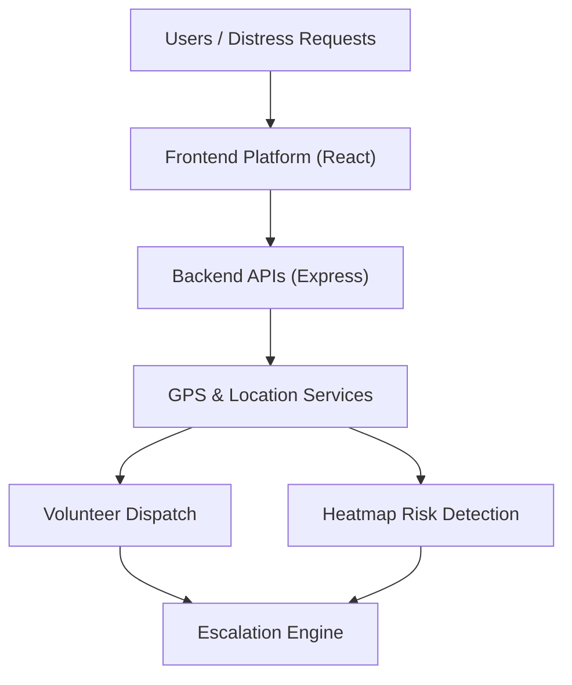

# 🌍 SVAS 2.0 — Smart Resource Allocation for Social Impact

<p align="center">
  <strong>Predictive Crisis Intelligence for Smarter Humanitarian Response</strong>
</p>

<p align="center">
Turning disaster response from reactive aid into intelligent anticipation.
</p>

<p align="center">
  <a href="https://smart-resource-allocation-data-driven-volunteer-coor-8a06ellad.vercel.app"><strong>🚀 View Live Prototype</strong></a>
</p>

<p align="center">


</p>

---

## 🚨 Problem Statement

Traditional volunteer coordination and disaster relief systems are largely **reactive** — help is mobilized only after requests are made, often resulting in delays, resource bottlenecks, and unmet critical needs.

Key challenges include:

* Fragmented coordination between volunteers, NGOs, hospitals, and emergency agencies
* Poor resource visibility during crises
* Delayed response in high-risk zones
* Lack of predictive planning before disasters escalate
* Weak support in low-connectivity or offline environments

### The Core Challenge

How can humanitarian aid become **predictive, intelligent, and scalable**, ensuring help reaches the right people at the right time — even before they ask?

---

# 💡 About SVAS 2.0

**SVAS 2.0 (Smart Volunteer Allocation System)** is an AI-powered crisis intelligence platform that predicts emergencies, optimizes resource deployment, and coordinates volunteers dynamically in real time.

Unlike conventional response systems, SVAS 2.0 does not just respond to disasters — it anticipates them.

It combines:

* Real-time weather and hazard signals
* Crowd-generated incident reports
* Geospatial intelligence and Heatmap clustering
* Smart escalation workflows
* Offline/SMS support for low-network regions

## What It Does

✔ Predicts risks before escalation using dynamic zone mapping
✔ Prepositions aid and volunteers intelligently
✔ Connects citizens, NGOs, hospitals and authorities
✔ Escalates unresolved requests across multiple levels
✔ Provides live GPS tracking and resource repositioning

---

# ✨ Unique Value Proposition

| Traditional Systems         | SVAS 2.0                          |
| --------------------------- | --------------------------------- |
| Reactive response           | Predictive response               |
| Manual volunteer assignment | Dynamic, location-based matching  |
| Static resource allocation  | Adaptive repositioning via zones  |
| Limited coordination        | Unified emergency ecosystem       |
| One-level escalation        | Multi-tier intelligent escalation |
| Basic reporting             | Real-time heatmap intelligence    |

### USP

> A location-aware, predictive humanitarian response platform that deploys help intelligently at every scale.

---

# 🔥 Key Features

## Feature Matrix

| Feature                         | Description                                                          |
| ------------------------------- | -------------------------------------------------------------------- |
| Predictive Risk Intelligence    | Forecasts risk zones based on incident concentration                 |
| Dynamic Resource Repositioning  | Automatically visualizes and shifts resources to demand hotspots     |
| Real-time Crisis Maps           | GPS-driven interactive Leaflet maps with live incident tracking      |
| Heatmap + Cluster AI            | Detects crisis hotspots and prioritizes response via visual layers   |
| Live Volunteer Tracking         | Monitors mission movement in real time                               |
| Smart Escalation Engine         | Escalates Volunteer → Team → NGO → Emergency Services                |
| Premium "Cyber Blue" UI         | High-fidelity dark mode dashboards using Tailwind & Framer Motion    |

---

# 🏗 Architecture Overview

## Multi-Layer System Architecture

### 1. Frontend Layer (React + Vite)
* Citizen Request Portal
* Volunteer Dashboard
* Real-time Crisis Map (Leaflet)
* Data visualization (Recharts)

### 2. Backend/API Layer (Node.js + Express)
* Request routing engine
* GPS-based dynamic data seeding
* Real-time updates APIs
* Local JSON persistent storage (`db.json`)

### 3. Intelligence & Mapping Layer
* Real-time user geolocation tracking
* Radius-based incident mapping and zone generation
* Geospatial heatmaps

---

## Architecture Diagram



---

# 🛠 Tech Stack

| Layer       | Technologies                                   |
| ----------- | ---------------------------------------------- |
| Frontend    | React, TypeScript, Vite                        |
| Styling     | Tailwind CSS, Framer Motion, Shadcn UI, MUI    |
| Maps        | Leaflet, React Leaflet, Leaflet.heat           |
| Analytics   | Recharts                                       |
| Backend     | Node.js, Express, CORS                         |
| Data Store  | Local File-based JSON Database (`db.json`)     |

---

# ⚙ Installation

## 1. Clone Repository

```bash
git clone https://github.com/janani152519/Smart-Resource-Allocation-Data-Driven-Volunteer-Coordination-for-Social-Impact.git
cd Smart-Resource-Allocation-Data-Driven-Volunteer-Coordination-for-Social-Impact
```

## 2. Install Dependencies & Run
The project uses `concurrently` to run both the React frontend and Express backend with a single command.

```bash
npm install
npm run dev
```

The application will be available at:
* **Frontend:** `http://localhost:5173`
* **Backend API:** `http://localhost:3001`

---

# 🔌 API Endpoints

The Express backend runs on port 3001 and provides the following RESTful endpoints:

| Endpoint              | Method   | Purpose                                           |
| --------------------- | -------- | ------------------------------------------------- |
| `/api/seed`           | `POST`   | Seed realistic data around user's GPS coordinates |
| `/api/map-data`       | `GET`    | Fetch all incidents, volunteers, and zones        |
| `/api/requests`       | `GET`    | Fetch all active help requests                    |
| `/api/requests`       | `POST`   | Create a new help or SOS request                  |
| `/api/requests/:id`   | `PATCH`  | Update the status/helper of an existing request   |
| `/api/volunteers`     | `GET`    | Fetch all registered volunteers                   |
| `/api/zones`          | `GET`    | Fetch current crisis zone activity data           |
| `/api/updates`        | `GET`    | Fetch the 5 most recent live feed updates         |

---

# 📂 Repository Structure

```bash
SVAS-2.0/
│
├── src/                 # React Frontend Code
│   ├── app/
│   │   ├── components/  # UI components (Maps, Modals, Shadcn)
│   │   ├── pages/       # Dashboard, Help, and Request views
│   │   ├── App.tsx      # Main Layout
│   │   └── routes.ts    # Application Routing
│   ├── styles/          # Global styles and Tailwind configs
│   └── main.tsx         # React Entry Point
│
├── server/              # Node.js Backend Code
│   ├── server.js        # Express API definitions & Data Logic
│   └── db.json          # Persistent file-based data store
│
├── package.json         # Root dependencies and Concurrent Scripts
├── vite.config.ts       # Vite configuration
└── README.md            # Project Documentation
```

---

# 🚀 Future Development

SVAS 2.0 roadmap includes:

* Integration of Federated AI risk models and Google Gemini
* Drone-assisted supply routing
* Multilingual voice emergency agents
* Transition from JSON file-based storage to a scalable Cloud Database (e.g., MongoDB/PostgreSQL)
* WebSockets (Socket.io) for instantaneous push updates

---

# 🌱 Social Impact

SVAS 2.0 contributes toward resilient communities by:

* Reducing emergency response delays
* Increasing equitable aid distribution
* Strengthening community-led crisis coordination
* Enabling scalable humanitarian intelligence

## UN SDG Alignment

Supports:
* SDG 3 — Good Health and Well-being
* SDG 9 — Industry, Innovation and Infrastructure
* SDG 11 — Sustainable Cities and Communities
* SDG 13 — Climate Action
* SDG 17 — Partnerships for the Goals

---

# 👥 Contributors

## Team The Solutionists

* **Janani P** — Team Lead
* **Manoj Vishnu R** — Contributor

---

# 🔐 License

Licensed under the MIT License.

---

# ⭐ Support This Project

If you find this project meaningful:

* Star the repository ⭐
* Fork and contribute 🍴
* Share feedback 💡

> **Building intelligent humanitarian systems for resilient communities.**

<p align="center">
Made with impact-driven innovation for social good.
</p>
