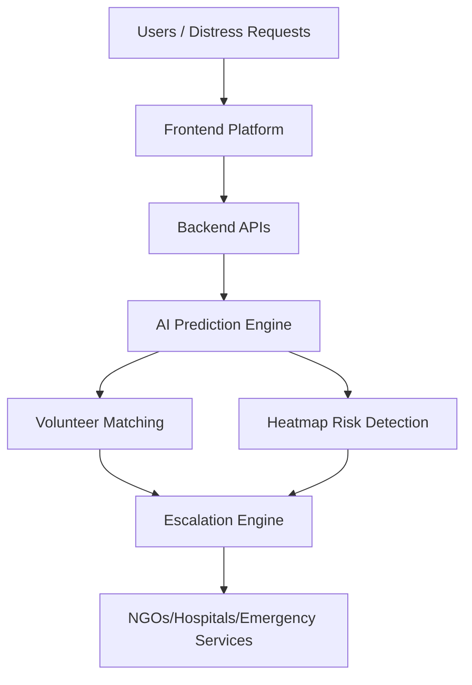
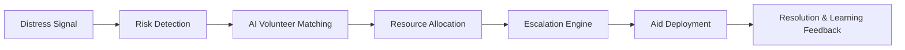

# 🌍 SVAS 2.0 — Smart Resource Allocation for Social Impact

<p align="center">
  <strong>Predictive Crisis Intelligence for Smarter Humanitarian Response</strong>
</p>

<p align="center">
Turning disaster response from reactive aid into intelligent anticipation.
</p>

<p align="center">


</p>

---

## 🚨 Problem Statement

Traditional volunteer coordination and disaster relief systems are largely **reactive** — help is mobilized only after requests are made, often resulting in delays, resource bottlenecks, and unmet critical needs.

Key challenges include:

* Fragmented coordination between volunteers, NGOs, hospitals, and emergency agencies
* Poor resource visibility during crises
* Delayed response in high-risk zones
* Lack of predictive planning before disasters escalate
* Weak support in low-connectivity or offline environments

### The Core Challenge

How can humanitarian aid become **predictive, intelligent, and scalable**, ensuring help reaches the right people at the right time — even before they ask?

---

# 💡 About SVAS 2.0

**SVAS 2.0 (Smart Volunteer Allocation System)** is an AI-powered crisis intelligence platform that predicts emergencies, optimizes resource deployment, and coordinates volunteers dynamically in real time.

Unlike conventional response systems, SVAS 2.0 does not just respond to disasters — it anticipates them.

It combines:

* Real-time weather and hazard signals
* Crowd-generated incident reports
* Geospatial intelligence
* AI-powered volunteer matching
* Smart escalation workflows
* Offline/SMS support for low-network regions

## What It Does

✔ Predicts risks before escalation
✔ Prepositions aid and volunteers intelligently
✔ Matches responders dynamically using AI
✔ Connects citizens, NGOs, hospitals and authorities
✔ Escalates unresolved requests across multiple levels
✔ Learns continuously from past response outcomes

---

# ✨ Unique Value Proposition

| Traditional Systems         | SVAS 2.0                          |
| --------------------------- | --------------------------------- |
| Reactive response           | Predictive response               |
| Manual volunteer assignment | AI dynamic matching               |
| Static resource allocation  | Adaptive repositioning            |
| Limited coordination        | Unified emergency ecosystem       |
| One-level escalation        | Multi-tier intelligent escalation |
| Basic reporting             | Self-learning crisis intelligence |

### USP

> A self-learning, predictive humanitarian response platform that deploys help intelligently at every scale — even offline.

---

# 🔥 Key Features

## Feature Matrix

| Feature                         | Description                                                          |
| ------------------------------- | -------------------------------------------------------------------- |
| Predictive Risk Intelligence    | Forecasts risk zones before emergencies escalate                     |
| AI Smart Matching               | Assigns optimal volunteers based on speed, trust and success history |
| Dynamic Resource Repositioning  | Automatically shifts idle resources to demand hotspots               |
| Self-Learning Reputation Engine | Improves volunteer reliability scoring over time                     |
| Smart Escalation Engine         | Escalates Volunteer → Team → NGO → Emergency Services                |
| Crowd Intelligence Mapping      | Uses live reports and crowdsourced signals                           |
| Heatmap + Cluster AI            | Detects crisis hotspots and prioritizes response                     |
| Offline & SMS Support           | Operates in low-bandwidth environments                               |
| Live Volunteer Tracking         | Monitors mission movement in real time                               |

---

# 🏗 Architecture Overview

## Multi-Layer System Architecture

### 1. Frontend Layer

* Citizen request portal
* Volunteer dashboard
* NGO control panel
* Real-time crisis map

### 2. Backend/API Layer

* Request routing engine
* Resource management services
* Real-time updates APIs
* Escalation workflow logic

### 3. AI Intelligence Layer

* Risk prediction models
* Volunteer matching engine
* Heatmap clustering analysis
* Self-learning decision optimization

### 4. Data Sources

* Weather APIs
* Geolocation services
* Crowd reports
* Emergency response data

### 5. Response Execution Layer

* Volunteer deployment
* NGO escalation
* Hospital routing
* Emergency authority escalation

---

## Architecture Diagram



---

# 🛠 Tech Stack

| Layer       | Technologies                |
| ----------- | --------------------------- |
| Frontend    | React, TypeScript           |
| Build Tool  | Vite                        |
| Styling     | Tailwind CSS, Framer Motion |
| Maps        | Leaflet, React Leaflet      |
| Analytics   | Recharts                    |
| Backend     | Node.js, Express            |
| APIs        | REST APIs                   |
| AI Services | Google Gemini               |
| Deployment  | Cloud Deployment            |

---

# 🔄 Workflow / Process Flow



# ⚙ Installation

## Clone Repository

```bash
git clone https://github.com/your-username/svas-2.0.git
cd svas-2.0
```

## Install Frontend

```bash
npm install
npm run dev
```

## Start Backend

```bash
cd server
npm install
npm start
```

---

# 🔌 API Endpoints

| Endpoint  | Purpose                      |
| --------- | ---------------------------- |
| /seed     | Initial data setup           |
| /map-data | Crisis map and location data |
| /requests | Incoming help requests       |
| /updates  | Real-time status updates     |

---

# 🚀 Future Development

SVAS 2.0 roadmap includes:

## Planned Innovations

* Digital twins for disaster simulation
* Federated AI risk models
* Drone-assisted supply routing
* Satellite-driven hazard prediction
* Multilingual voice emergency agents
* Autonomous aid recommendation engines
* Blockchain-backed relief transparency

---

# 🌱 Social Impact

SVAS 2.0 contributes toward resilient communities by:

* Reducing emergency response delays
* Increasing equitable aid distribution
* Strengthening community-led crisis coordination
* Supporting underserved low-connectivity regions
* Enabling scalable humanitarian intelligence

## UN SDG Alignment

Supports:

* SDG 3 — Good Health and Well-being
* SDG 9 — Industry, Innovation and Infrastructure
* SDG 11 — Sustainable Cities and Communities
* SDG 13 — Climate Action
* SDG 17 — Partnerships for the Goals

---

# 👥 Contributors

## Team The Solutionists

* Janani P — Team Lead
* Contributors — Manoj Vishnu R

---

# 📂 Repository Structure

```bash
SVAS-2.0/
│
├── client/
│   ├── components/
│   ├── pages/
│   └── services/
│
├── server/
│   ├── routes/
│   ├── controllers/
│   └── models/
│
├── assets/
├── docs/
└── README.md
```

---

# 🔐 License

Licensed under the MIT License.

```text
Permission is hereby granted, free of charge, to any person obtaining a copy
of this software and associated documentation files...
```

---

# 🤝 Why This Matters

Disaster response should not begin after suffering starts.

SVAS 2.0 reimagines humanitarian coordination as an intelligent system that predicts, prioritizes, and deploys support before communities are overwhelmed.

---

# ⭐ Support This Project

If you find this project meaningful:

* Star the repository ⭐
* Fork and contribute 🍴
* Share feedback 💡

---

## Closing Note

> **Building intelligent humanitarian systems for resilient communities.**

---

<p align="center">
Made with impact-driven innovation for social good.
</p>

